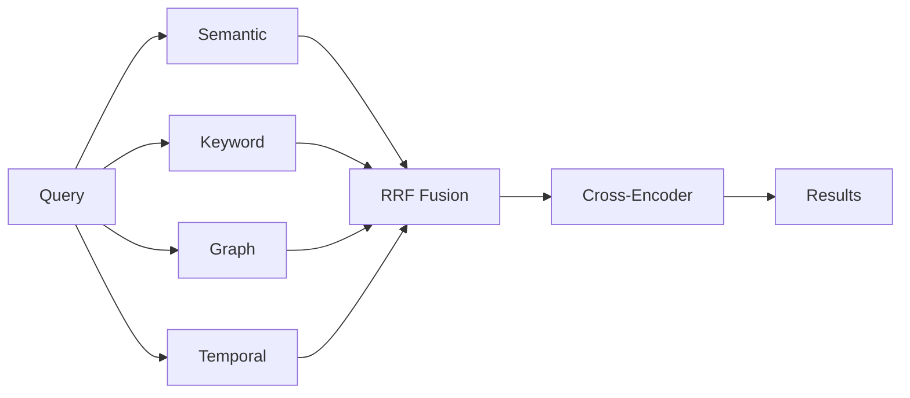

# Recall: How Hindsight Retrieves Memories

When you call `recall()`, Hindsight uses multiple search strategies in parallel to find the most relevant memories, regardless of how you phrase your query.



---

## The Challenge of Memory Recall

Different queries need different search approaches:

- **"Alice works at Google"** → needs exact name matching
- **"Where does Alice work?"** → needs semantic understanding
- **"What did Alice do last spring?"** → needs temporal reasoning
- **"Why did Alice leave?"** → needs causal relationship tracing

No single search method handles all these well. Hindsight solves this with **TEMPR** — four complementary strategies that run in parallel.

---

## Four Search Strategies

### Semantic Search

**What it does:** Understands the *meaning* behind words, not just the words themselves.

**Best for:**
- Conceptual matches: "Alice's job" → "Alice works as a software engineer"
- Paraphrasing: "Bob's expertise" → "Bob specializes in machine learning"
- Synonyms: "meeting" matches "conference", "discussion", "gathering"

**Why it matters:** You can ask questions naturally without matching exact keywords.

---

### Keyword Search

**What it does:** Finds exact terms and names, even when they're spelled uniquely.

**Best for:**
- Proper nouns: "Google", "Alice Chen", "MIT"
- Technical terms: "PostgreSQL", "HNSW", "TensorFlow"
- Unique identifiers: URLs, product names, specific phrases

**Why it matters:** Ensures you never miss results that mention specific names or terms, even if they're semantically distant from your query.

**Backends:** Hindsight ships five pluggable BM25 backends, selected via
`HINDSIGHT_API_TEXT_SEARCH_EXTENSION`:

| Backend | What it uses | Citus-compatible? |
|---|---|---|
| `native` | PostgreSQL `tsvector` + `ts_rank_cd` (TF-IDF, not true BM25) | Yes |
| `vchord` | `vchord_bm25` extension | No |
| `pg_textsearch` | Timescale `pg_textsearch` extension | No |
| `pgroonga` | PGroonga (Groonga) full-text extension, `TokenBigram` polyglot tokenizer | No |
| `pg_search` | ParadeDB `pg_search` extension, configurable tokenizer (e.g. `jieba`, `chinese_compatible`, `ngram`) via `HINDSIGHT_API_TEXT_SEARCH_EXTENSION_PG_SEARCH_TOKENIZER` | Yes |

If you need true BM25 ranking on a horizontally scaled Postgres (Citus) cluster,
`pg_search` is the only option. See the [`pg_search` docker-compose example](https://github.com/vectorize-io/hindsight/tree/main/docker/docker-compose/pg_search).

---

### Graph Traversal

**What it does:** Follows connections between entities to find indirectly related information.

**Best for:**
- Indirect relationships: "What does Alice do?" → Alice → Google → Google's products
- Entity exploration: "Bob's colleagues" → Bob → co-workers → shared projects
- Multi-hop reasoning: "Alice's team's achievements"

**Why it matters:** Retrieves facts that aren't semantically or lexically similar but are **structurally connected** through the knowledge graph.

**Example:** Even if Alice and her manager are never mentioned together, graph traversal can find the manager through shared projects or team relationships.

---

### Temporal Search

**What it does:** Understands time expressions and filters by when events occurred.

**Best for:**
- Historical queries: "What did Alice do in 2023?"
- Time ranges: "What happened last spring?"
- Relative time: "What did Bob work on last year?"
- Before/after: "What happened before Alice joined Google?"

**How it works:** Combines semantic understanding with time filtering to find events within specific periods.

**Why it matters:** Enables precise historical queries without losing old information.

---

## Result Fusion

After the four strategies run, results are **fused together**:

- Memories appearing in **multiple strategies** rank higher (consensus)
- **Rank matters more than score** (robust across different scoring systems)
- Final results are **re-ranked** using a neural model that considers query-memory interaction

**Why fusion matters:** A fact that's both semantically similar AND mentions the right entity will rank higher than one that's only semantically similar.

---

## Why Multiple Strategies?

Consider the query: **"What did Alice say about Python last spring?"**

- **Semantic** finds facts about Alice's views on programming
- **Keyword** ensures "Python" is actually mentioned
- **Graph** connects Alice → programming languages → related entities
- **Temporal** filters to "last spring" timeframe

The **fusion** of all four gives you exactly what you're looking for, even though no single strategy would suffice.

---

## Token Budget Management

Hindsight is built for AI agents, not humans. Traditional search systems return "top-k" results, but agents don't think in terms of result counts—they think in tokens. An agent's context window is measured in tokens, and that's exactly how Hindsight measures results.

**How it works:**
- Top-ranked memories selected first
- Stops when token budget is exhausted
- You specify context budget, Hindsight fills it with the most relevant memories

**Parameters you control:**
- `max_tokens`: How much memory content to return (default: 4096 tokens)
- `budget`: Search depth level (low, mid, high)
- `types`: Filter by world, experience, observation, or all
- `tags`: Filter memories by visibility tags
- `tags_match`: How to match tags (see [Recall API](./api/recall) for all options)

### Expanding Context: Chunks

Memories are distilled facts—concise but sometimes missing nuance. When your agent needs deeper context, you can optionally retrieve the source material:

**Chunks** return the raw text that generated each memory—useful when the distilled fact loses important nuance:

```
Memory: "Alice prefers Python over JavaScript"
Chunk:  "Alice mentioned she prefers Python over JavaScript, mainly because
         of its data science ecosystem, though she admits JS is better for
         frontend work and she's been learning TypeScript lately."
```

Use `include_chunks=True` with `max_chunk_tokens` to control the token budget for chunks. This is useful when generating responses that need verbatim quotes or when context matters (e.g., "What exactly did Alice say about the project?").

---

## Tuning Recall: Quality vs Latency

Different use cases require different trade-offs between **recall quality** and **response speed**. Two parameters control this:

### Budget: Search Depth

Controls how thoroughly Hindsight explores the memory bank—affecting graph traversal depth, candidate pool size, and cross-encoder re-ranking:

| Budget | Best For | Trade-off |
|--------|----------|-----------|
| **low** | Quick lookups, simple queries | Fast, may miss indirect connections |
| **mid** | Most queries, balanced | Good coverage, reasonable speed |
| **high** | Complex queries requiring deep exploration | Thorough, slower |

**Example:** "What did Alice's manager's team work on?" benefits from high budget to traverse multiple hops (Alice → manager → team → projects) and evaluate more candidates.

### Max Tokens: Context Window Size

Controls how much memory content to return:

| Max Tokens | ~Pages of Text | Best For | Trade-off |
|------------|----------------|----------|-----------|
| **2048** | ~2 pages | Focused answers, fast LLM | Fewer memories, faster |
| **4096** (default) | ~4 pages | Balanced context | Good coverage, standard |
| **8192** | ~8 pages | Comprehensive context | More memories, slower LLM |

**Example:** "Summarize everything about Alice" benefits from higher max_tokens to include more facts.

### Two Independent Dimensions

Budget and max_tokens control different aspects of recall:

| Parameter | What it controls | Latency impact | Example |
|-----------|------------------|----------------|---------|
| **Budget** | How thoroughly to explore memories | Search time | High budget finds Alice → manager → team → projects |
| **Max Tokens** | How much context to return | LLM processing time | High tokens returns more memories to the agent |

**They're independent.** Common combinations:

| Budget | Max Tokens | Use Case |
|--------|------------|----------|
| high | low | Deep search, return only the best results |
| low | high | Quick search, return everything found |
| high | high | Comprehensive research queries |
| low | low | Fast chatbot responses |

### Recommended Configurations

| Use Case | Budget | Max Tokens | Why |
|----------|--------|------------|-----|
| **Chatbot replies** | low | 2048 | Fast responses, focused context |
| **Document Q&A** | mid | 4096 | Balanced coverage and speed |
| **Research queries** | high | 8192 | Comprehensive, multi-hop reasoning |
| **Real-time search** | low | 2048 | Minimize latency |

---

## Scoring & Ranking Deep Dive

This section explains exactly how Hindsight turns raw retrieval results into a final ranked list. The pipeline has three stages: **RRF fusion**, **cross-encoder reranking**, and **combined scoring**.

### Stage 1: Reciprocal Rank Fusion (RRF)

After all strategies run in parallel, their results are merged using [Reciprocal Rank Fusion](https://plg.uwaterloo.ca/~gvcormac/cormacksigir09-rrf.pdf). RRF combines ranked lists by rewarding items that appear highly ranked across multiple strategies, without relying on raw scores (which aren't comparable across different retrieval methods).

**Formula:**

```
score(d) = Σ  1 / (k + rank_i(d))
           i
```

Where:
- **k = 60** (smoothing constant — prevents top-ranked items from dominating)
- **rank_i(d)** = position of document *d* in strategy *i* (1-indexed)
- The sum runs over all strategies where *d* appears

**All four strategies are weighted equally.** There are no per-strategy weight multipliers — importance comes from rank position, not the source.

**Why RRF over raw score merging?** Each retrieval strategy produces scores on a different scale (cosine similarity, BM25 tf-idf, graph activation). These scores aren't comparable — a BM25 score of 12.5 and a cosine similarity of 0.85 don't mean the same thing. RRF sidesteps this by using only rank positions, making it robust across any scoring system without requiring calibration.

**Example:** A memory ranked #1 in semantic and #5 in BM25:
```
RRF score = 1/(60+1) + 1/(60+5) = 0.0164 + 0.0154 = 0.0318
```

A memory ranked #1 in semantic only:
```
RRF score = 1/(60+1) = 0.0164
```

The first memory ranks higher because it has **consensus** across strategies.

---

### Stage 2: Cross-Encoder Reranking

RRF gives a good initial ranking, but it's based on positions, not on deep query-document understanding. The cross-encoder evaluates each candidate against the query as a pair, producing a relevance score.

**Pre-filtering:** Before reranking, candidates are trimmed to the top **300** (by RRF score) to limit computational cost. This is configurable via `HINDSIGHT_API_RERANKER_MAX_CANDIDATES`.

**Why rerank after RRF?** RRF is position-based — it knows a memory ranked well across strategies, but it never actually reads the query and the memory together. The cross-encoder does: it takes the query and each candidate as a pair and produces a relevance score based on their full interaction. This catches nuances that position-based fusion misses, like a memory that ranked #1 in keyword search because it matched a common term but is actually irrelevant to the query's intent.

**Score normalization:** Cross-encoders output raw logits (which can be negative). Scores that already fall within [0, 1] — as returned by calibrated external API rerankers (e.g. Cohere, SiliconFlow, ZeroEntropy, Alibaba, Jina) — are passed through unchanged to preserve their absolute confidence. Raw logits outside [0, 1] are normalized to [0, 1] using the sigmoid function:

```
CE_normalized = 1 / (1 + e^(-raw_logit))
```

**Batch processing:** Candidates are scored in batches — **32 pairs** for the local reranker, **128 pairs** for TEI.

:::tip No cross-encoder?
When running without a cross-encoder (e.g., slim image with no external reranker), the system falls back to RRF-derived scores: candidates are assigned synthetic scores spread across [0.1, 1.0] based on their RRF rank, so the combined scoring boosts below still work meaningfully.
:::

---

### Stage 3: Combined Scoring (Boosts)

The normalized cross-encoder score is adjusted by three **multiplicative boosts** that incorporate signals the cross-encoder can't see: recency, temporal proximity, and evidence strength.

**Why multiplicative instead of additive?** Additive boosts (e.g., `CE + 0.1 × recency`) would give the same absolute bonus to every candidate regardless of relevance. A barely-relevant memory could leapfrog a highly-relevant one just by being recent. Multiplicative boosts keep adjustments proportional to the base relevance score — a +10% nudge on a high-relevance memory is a bigger absolute change than +10% on a low-relevance one. This ensures secondary signals never overpower the primary relevance judgment.

**Formula:**

```
final_score = CE_normalized × recency_boost × temporal_boost × proof_count_boost
```

Each boost is centered at 1.0 (neutral) and controlled by an alpha that caps how much it can swing:

```
boost = 1 + α × (signal - 0.5)
```

| Boost | α | Max adjustment | What it rewards |
|-------|---|----------------|-----------------|
| **Recency** | 0.2 | ±10% | Recent memories over older ones |
| **Temporal proximity** | 0.2 | ±10% | Memories close to a queried time window |
| **Proof count** | 0.1 | ±5% | Observations backed by more evidence |

#### Recency signal

Linear decay over 365 days from the memory's occurrence date:

```
recency = clamp(1.0 - days_ago / 365, 0.1, 1.0)
```

A memory from the query timestamp has recency 1.0 (+10% boost). A memory from 6 months before the query timestamp has recency ~0.5 (neutral). A memory more than a year before the query timestamp has recency 0.1 (-8% penalty). If no `query_timestamp` is provided, the server's current time is used. Memories without dates get 0.5 (neutral — no boost or penalty).

#### Temporal proximity signal

Only active when the query contains a time reference (e.g., "last spring", "in 2023"). Measures how close a memory's date is to the center of the queried time window:

```
temporal_proximity = 1.0 - min(days_from_center / (window_days / 2), 1.0)
```

A memory at the center of the window gets 1.0 (+10% boost). A memory at the edge gets 0.0 (-10% penalty). For non-temporal queries, all memories get 0.5 (neutral).

#### Proof count signal

For observation-type memories, rewards those backed by more evidence using a logarithmic curve:

```
proof_norm = clamp(0.5 + ln(proof_count) / 10, 0.0, 1.0)
```

| Proof count | proof_norm | Boost |
|-------------|-----------|-------|
| 1 | 0.5 | Neutral |
| 3 | 0.61 | +1.1% |
| 10 | 0.73 | +2.3% |
| 150+ | 1.0 | +5% (max) |

#### Maximum combined range

With all boosts at their extremes:
- **Best case:** ×1.10 × 1.10 × 1.05 ≈ **+27%**
- **Worst case:** ×0.90 × 0.90 × 0.95 ≈ **-23%**

The boosts are intentionally conservative — they nudge the ranking without overriding cross-encoder relevance.

---

### Stage 4: Token Truncation

After scoring, results are sorted by `final_score` and selected top-down until the `max_tokens` budget is exhausted. Only the memory text counts toward the budget — metadata is free.

---

### How Budget Maps to Pipeline Parameters

The `budget` parameter (low/mid/high) controls **search depth** — how many candidates each strategy considers. Each level maps to a **recall budget** number that flows through every pipeline stage:

| Budget | Recall budget (fixed mode) | Env var override |
|--------|---------------------------|-----------------|
| **low** | 100 | `HINDSIGHT_API_RECALL_BUDGET_FIXED_LOW` |
| **mid** | 300 (default) | `HINDSIGHT_API_RECALL_BUDGET_FIXED_MID` |
| **high** | 1000 | `HINDSIGHT_API_RECALL_BUDGET_FIXED_HIGH` |

This recall budget flows through the pipeline as follows:

| Pipeline stage | How the recall budget is used |
|----------------|-------------------------------|
| **Semantic search** | Over-fetches max(recall_budget × 5, 100) from HNSW, trims to recall_budget |
| **BM25 search** | `LIMIT recall_budget` in SQL |
| **Graph traversal** | Explores up to recall_budget nodes |
| **Temporal spreading** | Activates up to recall_budget nodes via links |
| **Result consideration** | Top recall_budget × 2 results considered for token filtering |

Reranking pre-filter (300 candidates) is **independent** of budget — it's a separate knob (`HINDSIGHT_API_RERANKER_MAX_CANDIDATES`).

:::info Adaptive budgeting
An alternative budget mode scales the recall budget with `max_tokens` instead of using fixed values:

```
recall_budget = clamp(max_tokens × ratio, min, max)
```

| Budget | Ratio | Env var override |
|--------|-------|-----------------|
| low | 2.5% of max_tokens | `HINDSIGHT_API_RECALL_BUDGET_ADAPTIVE_LOW` |
| mid | 7.5% of max_tokens | `HINDSIGHT_API_RECALL_BUDGET_ADAPTIVE_MID` |
| high | 25% of max_tokens | `HINDSIGHT_API_RECALL_BUDGET_ADAPTIVE_HIGH` |

The result is clamped to a floor of **20** (`HINDSIGHT_API_RECALL_BUDGET_MIN`) and a ceiling of **2000** (`HINDSIGHT_API_RECALL_BUDGET_MAX`).

Enable with `HINDSIGHT_API_RECALL_BUDGET_FUNCTION=adaptive`.
:::

---

### Graph Scoring Detail

The graph traversal (link expansion) combines three independent signals additively for each candidate:

| Signal | Score formula | Range |
|--------|--------------|-------|
| **Entity overlap** | tanh(shared_entity_count × 0.5) | [0, ~1.0] |
| **Semantic link** | Precomputed kNN link weight | [0.7, 1.0] |
| **Causal link** | Causal link weight | [0, 1.0] |

```
graph_score = entity_score + semantic_score + causal_score   ∈ [0, 3]
```

The additive combination rewards **convergent evidence** — a memory connected to the query through multiple signal types ranks higher than one connected through a single strong signal.

**Why tanh for entity scores?** Raw shared-entity count is unbounded — a high-fanout entity like "user" could produce counts of 50+, drowning out the other two signals. `tanh(count × 0.5)` saturates naturally: the first few shared entities matter a lot (1→0.46, 2→0.76, 3→0.91), but additional ones contribute diminishing returns, keeping the entity signal in [0, 1] alongside semantic and causal scores.

**Why additive instead of multiplicative here?** Unlike the combined scoring boosts, graph signals are independent evidence channels, not adjustments to a base score. A memory might be connected only through causal links (no shared entities, no semantic similarity) — multiplicative combination would zero it out. Additive scoring lets each signal contribute independently, and the outer RRF fusion handles ranking across strategies.

**Entity signal example:** A memory sharing 1 entity with the query scores tanh(0.5) ≈ 0.46. Two shared entities score tanh(1.0) ≈ 0.76. Three or more saturate near 0.91+.

---

## Next Steps

- [**Retain**](./retain) — How memories are stored with rich context
- [**Reflect**](./reflect) — How disposition influences reasoning
- [**Recall API**](./api/recall) — Code examples, parameters, and tag filtering
