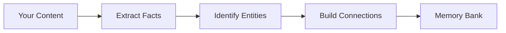

# Retain: How Hindsight Stores Memories

When you call `retain()`, Hindsight transforms conversations and documents into structured, searchable memories that preserve meaning and context.

## What Retain Does



---

## Rich Fact Extraction

Hindsight doesn't just store what was said — it captures **why**, **how**, and **what it means**.

### What Gets Captured

When you retain "Alice joined Google last spring and was thrilled about the research opportunities", Hindsight extracts:

**The core facts:**
- Alice joined Google
- This happened last spring

**The emotions and meaning:**
- She was thrilled
- It represented an important opportunity

**The reasoning:**
- She chose it for the research opportunities

This rich extraction means you can later ask "Why did Alice join Google?" and get a meaningful answer, not just "she joined Google."

### Preserving Context

Traditional systems fragment information:
- "Bob suggested Summer Vibes"
- "Alice wanted something unique"
- "They chose Beach Beats"

Hindsight preserves the full narrative:
- "Alice and Bob discussed naming their summer party playlist. Bob suggested 'Summer Vibes' because it's catchy, but Alice wanted something unique. They ultimately decided on 'Beach Beats' for its playful tone."

This means search results include the full context, not disconnected fragments.

---

## Two Types of Facts

Every fact is classified by **whose perspective it captures** — the agent that owns the bank, or the outside world:

| Type           | What it captures                                                              | Example |
|----------------|------------------------------------------------------------------------------|---------|
| **experience** | The bank's own agent acting, observing, or interacting — its first-person history | "I recommended Python to Alice" |
| **world**      | Facts about other people, places, things, and events                          | "Alice works at Google" |

The split is decided by **who is speaking**, not by grammar. A first-person statement is an `experience` only when the speaker *is* the bank's agent. The same words said by someone else are a `world` fact about that person:

- Agent's own log — "I patched the auth bug" → **experience** (the agent did it).
- A user talking to the agent — "I bought a Tesla" → **world** (a fact about the *user*, not the agent).

Two things steer this correctly:

- **Set a human-readable bank `name`** (the agent's name). It identifies who "the agent" is. If left unset it defaults to the `bank_id`; a `bank_id` that is a routing key (e.g. `my-agent::channel-456::user-789`) is not a usable speaker name, so give the bank a real name.
- **Describe the speaker in each item's `context`** when retaining transcripts or third-party content. For a chat log, a context like *"Customer Maria is speaking"* ensures her first-person statements are stored as `world` facts about Maria rather than mistaken for the agent's own experiences. The `context` takes precedence over the bank name when the two disagree.

**Note:** Observations are consolidated automatically in the background after `retain()` operations complete. This consolidation process synthesizes patterns from new facts into the bank's knowledge base.

---

## Entity Recognition

Hindsight automatically identifies and tracks **entities** — the people, organizations, and concepts that matter.

### What Gets Recognized

- **People:** "Alice", "Dr. Smith", "Bob Chen"
- **Organizations:** "Google", "MIT", "OpenAI"
- **Places:** "Paris", "Central Park", "California"
- **Products & Concepts:** "Python", "TensorFlow", "machine learning"

### Entity Resolution

The same entity mentioned different ways gets unified:
- "Alice" + "Alice Chen" + "Alice C." → one person
- "Bob" + "Robert Chen" → one person (nickname resolution)

**Why it matters:** You can ask "What do I know about Alice?" and get everything, even if she was mentioned as "Alice Chen" in some conversations.

### Context-Aware Disambiguation

If "Alice" appears with "Google" and "Stanford" multiple times, a new "Alice" mentioning those is likely the same person. Hindsight uses co-occurrence patterns to disambiguate common names.

### Entity Labels

You can define a controlled vocabulary of `key:value` classification labels (e.g. `pedagogy:scaffolding`, `engagement:active`) that are extracted at retain time and stored as entities. Because labels become entities, they automatically link related memories in the knowledge graph and improve both semantic and keyword retrieval. Labels can optionally also write to the memory unit's tags, enabling standard tag-based filtering during recall and reflect.

See [entity_labels in the bank config](api/memory-banks.md#entity-labels) for full configuration details.

---

## Building Connections

Memories aren't isolated — Hindsight creates a **knowledge graph** with four types of connections:

### Entity Connections

All facts mentioning the same entity are linked together.

**Enables:** "Tell me everything about Alice" → retrieves all Alice-related facts

### Time-Based Connections

Facts close in time are connected, with stronger links for closer dates.

**Enables:** "What else happened around then?" → finds contextually related events

### Meaning-Based Connections

Semantically similar facts are linked, even if they use different words.

**Enables:** "Tell me about similar topics" → finds thematically related information

### Causal Connections

Cause-effect relationships are explicitly tracked.

**Enables:** "Why did this happen?" → trace reasoning chains
**Example:** "Alice felt burned out" ← caused by ← "She worked 80-hour weeks"

---

## Understanding Time

Hindsight tracks **two temporal dimensions**:

### When It Happened

For events (meetings, trips, milestones), Hindsight records when they occurred.
- "Alice got married in June 2024" → occurred in June 2024

For general facts (preferences, characteristics), there's no specific occurrence time.
- "Alice prefers Python" → ongoing preference

### When You Learned It

Hindsight also tracks when you told it each fact.

**Why both?**

Imagine in January 2025, someone tells you "Alice got married in June 2024":
- **Historical queries** work: "What did Alice do in 2024?" → finds the marriage
- **Recency ranking** works: Recent mentions get priority in search
- **Temporal reasoning** works: "What happened before her marriage?" → finds earlier events

Without this distinction, old information would either be unsearchable by date or treated as irrelevant.

---

## Tagging Memories

Tags enable visibility scoping—useful when one memory bank serves multiple users but each should only see relevant memories.

- **Item tags**: Tag individual memories with specific scopes
- **Document tags**: Apply tags to all items in a batch
- **Tag filtering**: Filter during recall/reflect by tags

See [Retain API](./api/retain) for code examples and [Recall API](./api/recall) for filtering options.

---

## What You Get

After `retain()` completes:

- **Structured facts** that preserve meaning, emotions, and reasoning
- **Unified entities** that resolve different name variations
- **Knowledge graph** with entity, temporal, semantic, and causal links
- **Temporal grounding** for both historical and recency-based queries
- **Optional tags** for filtering during recall

All stored in your isolated **memory bank**, ready for `recall()` and `reflect()`.

---

## Steering Extraction with a Mission

By default, `retain()` extracts all significant facts from the content. You can narrow this focus with a **retain mission** (`retain_mission`) — a plain-language description of what this bank should pay attention to.

```
e.g. Always include technical decisions, API design choices, and architectural trade-offs.
     Ignore meeting logistics, greetings, and social exchanges.
```

The mission is injected into the extraction prompt alongside the built-in rules — it steers the LLM without replacing the extraction logic. It works with any extraction mode (`concise`, `verbose`, `custom`).

For finer control, you can also change the **extraction mode**:

| Mode | When to use |
|------|-------------|
| `concise` *(default)* | General-purpose — selective, fast |
| `verbose` | When you need richer facts with full context and relationships |
| `custom` | When you want to write your own extraction rules entirely |

Set `retain_mission` and `retain_extraction_mode` via the [bank config API](api/memory-banks.md#retain-configuration) or the [`HINDSIGHT_API_RETAIN_MISSION`](configuration.md#retain) environment variable.

---

## Observation Consolidation

After `retain()` completes, Hindsight automatically triggers **observation consolidation** in the background. This process:

1. Analyzes new facts against existing observations
2. Creates new observations when patterns emerge
3. Refines existing observations with new evidence
4. Tracks which facts support each observation

This happens asynchronously — your `retain()` call returns immediately while consolidation runs in the background.

See [Observations](./observations) for details on how consolidation works.

---

## Next Steps

- [**Observations**](./observations) — How knowledge is consolidated after retain
- [**Recall**](./retrieval) — How multi-strategy search retrieves relevant memories
- [**Reflect**](./reflect) — How the agentic loop uses observations
- [**Retain API**](./api/retain) — Code examples and parameters
